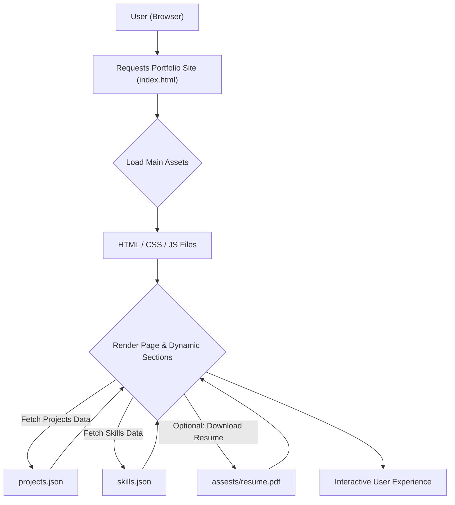

# 🚀 Portfolio Website

<p align="center"></p>

## Short Description
Unveiling a captivating and dynamic personal portfolio website, meticulously crafted to showcase a developer's skills, projects, and professional journey. This modern, responsive platform is engineered for immediate impact, providing an immersive experience for anyone looking to discover innovative work and technical expertise.

## ✨ Key Features
*   **Dynamic Project Showcase:** A beautifully presented, curated collection of diverse projects, each with dedicated pages and rich details to highlight ingenuity and execution.
*   **Interactive Skills Section:** Visually engaging and easy-to-digest representation of core technical proficiencies and specialized expertise.
*   **Comprehensive Experience Timeline:** A clear, chronological detailing of academic achievements and professional milestones, offering insight into career growth.
*   **Seamless Responsiveness:** Engineered with a mobile-first approach, ensuring an impeccable user experience across all devices and screen sizes.
*   **Automated Deployment (CI/CD):** Leverages GitHub Actions for robust continuous integration and deployment, guaranteeing a smooth and reliable update process.
*   **Downloadable Resume:** Provides convenient access to the developer's full resume in PDF format, ideal for recruiters and hiring managers.
*   **Engaging UI/UX:** Enhanced with subtle animations and a clean, modern aesthetic to create an intuitive and memorable browsing experience.
*   **Custom 404 Page:** Thoughtfully designed error page that maintains brand consistency and guides users back to the main content, even on broken links.

## Who is this for?
*   **Recruiters & Hiring Managers:** Efficiently evaluate a candidate's technical capabilities, project experience, and professional background.
*   **Potential Clients & Collaborators:** Gain a clear understanding of the developer's creative vision, problem-solving skills, and past successes.
*   **Fellow Developers:** Explore a well-structured frontend project, learn from its implementation, and draw inspiration for their own portfolios.
*   **Curious Minds:** Anyone interested in modern web development, UI/UX design, or discovering the professional journey of a dedicated developer.

## Technology Stack & Architecture
This portfolio website is a prime example of a modern static site, focusing on performance, user experience, and ease of deployment.

*   **Frontend:**
    *   **HTML5:** Structure and semantic content.
    *   **CSS3:** Custom styling (`assests/css/style.css`, `404.css`) for a unique aesthetic.
    *   **JavaScript:** Vanilla JavaScript (`assests/js/app.js`, `assests/js/script.js`, `assests/js/404.js`) for interactivity and dynamic content loading, augmented by libraries like `particles.min.js` for visual effects.
*   **Content Management:**
    *   **JSON:** Local `projects/projects.json` and `skills.json` files serve as simple data sources for dynamic content injection.
*   **Automation:**
    *   **GitHub Actions:** For Continuous Integration and Deployment (`.github/workflows/ci-cd.yml`), ensuring automatic builds and deployments upon code changes.
*   **Development Environment:**
    *   **VS Code:** Configured with `.vscode/settings.json` for consistent code formatting and developer experience.

## 📊 Architecture & Database Schema
This portfolio operates as a static site, where content is loaded dynamically from local JSON files. There's no traditional database, but a clear client-side flow.



## ⚡ Quick Start Guide
Get this impressive portfolio up and running in minutes!

1.  **Clone the Repository:**
    ```bash
    git clone https://github.com/devangrevandkar01-debug/portfolio_website.git
    cd portfolio_website
    ```

2.  **Open in Browser:**
    Simply open the `index.html` file located in the root directory with your preferred web browser.
    *   **macOS:** `open index.html`
    *   **Windows:** `start index.html`
    *   **Linux:** `xdg-open index.html`

3.  **Local Development (Optional):**
    For a more robust local development experience, especially for JavaScript modules or AJAX requests, serving the files via a local HTTP server is recommended.
    ```bash
    # Using Python's built-in HTTP server
    python -m http.server 8000
    # Then navigate to http://localhost:8000 in your browser
    ```
    Alternatively, you can use a Node.js-based server like `serve`:
    ```bash
    npm install -g serve
    serve .
    ```

## 📜 License
This project is licensed under the MIT License. See the `LICENSE` file for more details.