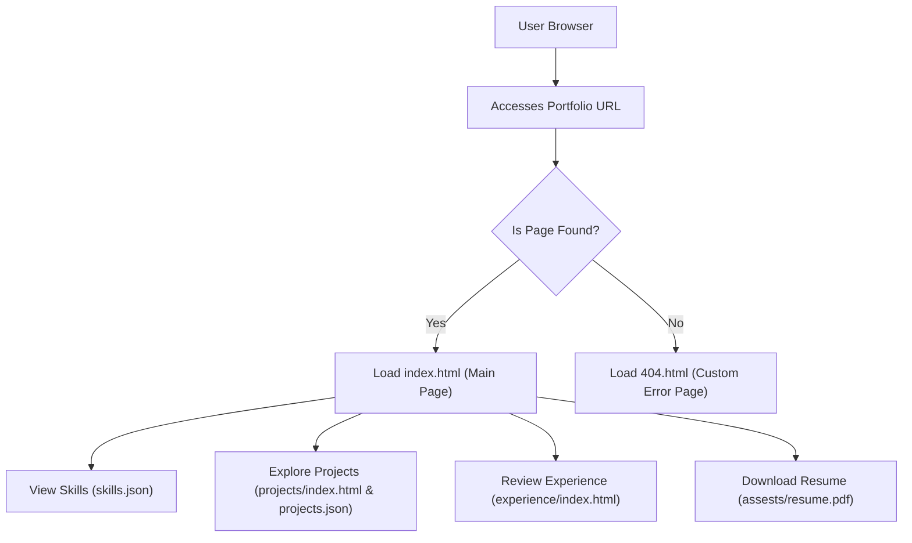

# 🚀 Portfolio Website

<p align="center"></p>

## Short Description
This repository hosts a meticulously crafted, modern, and highly responsive personal portfolio website. Designed to captivate, it elegantly showcases the developer's skills, professional experience, and a diverse range of projects. Featuring a dynamic interface and seamless navigation, it provides an immersive experience for anyone looking to understand the developer's capabilities and journey.

## ✨ Key Features
*   **Dynamic and Engaging UI:** Built with modern HTML, CSS, and JavaScript, featuring interactive elements and smooth animations powered by `particles.min.js`.
*   **Comprehensive Profile Showcase:** Dedicated sections for detailing technical skills (driven by `skills.json`), professional work experience, and a diverse portfolio of projects (managed via `projects/projects.json`).
*   **Automated CI/CD Pipeline:** Leverages GitHub Actions (`.github/workflows/ci-cd.yml`) for continuous integration and deployment, ensuring a smooth and reliable update process.
*   **Downloadable Resume:** Provides a direct link to the developer's resume (`assests/resume.pdf`) for easy access by recruiters and potential employers.
*   **Custom 404 Error Page:** A personalized and engaging 404 page (`404.html`) enhances user experience by gracefully handling invalid URLs.
*   **Responsive Design:** Optimized for a flawless viewing experience across a multitude of devices, from desktops to mobile phones.

## Who is this for?
*   **Recruiters & Hiring Managers:** Quickly assess the developer's technical prowess, project experience, and professional background.
*   **Fellow Developers:** Explore code structure, implementation details, and gain insights into project approaches.
*   **Potential Collaborators:** Discover complementary skills and past work to identify collaboration opportunities.
*   **Anyone Interested:** Get a comprehensive overview of the developer's technical journey and achievements.

## Technology Stack & Architecture
*   **Frontend:** HTML5, CSS3, JavaScript (Vanilla JS)
*   **Styling:** Custom CSS (`assests/css/style.css`) for a unique and polished aesthetic.
*   **Interactivity & Animations:** JavaScript (`assests/js/script.js`, `assests/js/app.js`) along with `particles.min.js` for dynamic visual effects.
*   **Data Management:** JSON files (`skills.json`, `projects/projects.json`) for easily manageable and updatable content.
*   **Development Workflow:** GitHub Actions for robust Continuous Integration and Continuous Deployment.
*   **Development Environment:** Configured for Visual Studio Code (`.vscode/settings.json`) for an optimized development experience.

## 📊 Architecture & Database Schema
This project is a static web application, meaning it serves pre-built HTML, CSS, and JavaScript files directly to the browser without a server-side backend or traditional database. Content is dynamically loaded using local JSON files. Below is a high-level flowchart illustrating the user interaction with the portfolio website:



## ⚡ Quick Start Guide
Getting this portfolio up and running is incredibly simple:

1.  **Clone the Repository:**
    ```bash
    git clone https://github.com/devangrevandkar01-debug/portfolio_website.git
    cd portfolio_website
    ```

2.  **Open in Browser:**
    Simply open the `index.html` file in your web browser. For a more robust local development experience, you might use a live server extension in VS Code or a simple HTTP server (`python -m http.server`).

## 📜 License
This project is licensed under an open-source license. Please refer to the `LICENSE` file in the repository root for full details.